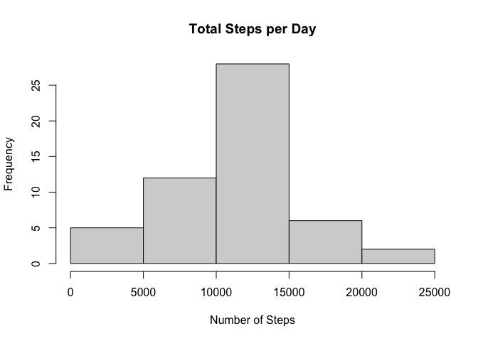
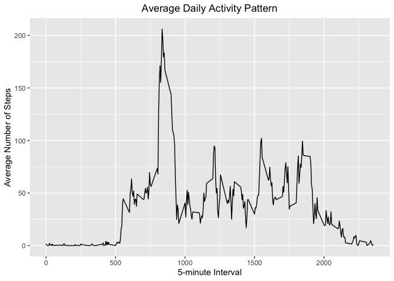
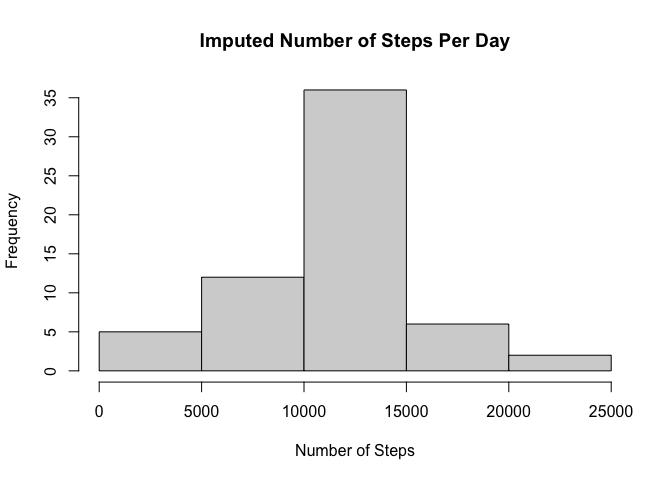
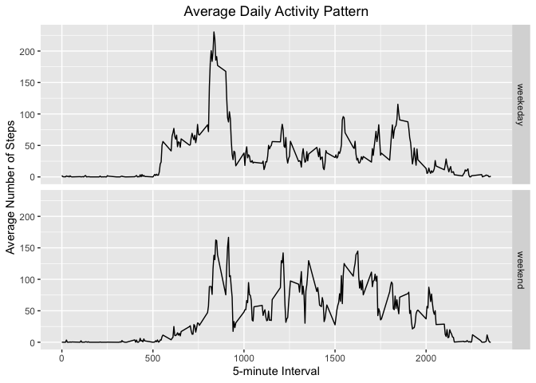

    library(knitr)
     setwd("/Users/tomaszosuchowski/Downloads/rprog_data_ProgAssignment3-data")
    ## knit2html("PA1_template.Rmd")
    browseURL("document.html")

    ## Check if file exists and download it otherwise
    if(!file.exists('activity.csv')){
      unzip(zipfile=activity.zip)
    }

    activityData <- read.csv(file="activity.csv", header=TRUE)
    ## activityData
    ## Mean total number of steps per day

    totalSteps <- aggregate(steps ~ date, activityData, FUN = sum)

    ## Histogram of the total steps per day

    hist(totalSteps$steps, main = "Total Steps per Day",
         xlab="Number of Steps")

    ## Mean and Median

    meanSteps <- mean(totalSteps$steps, na.rm = TRUE)
    medianSteps <- median(totalSteps$steps, na.rm = TRUE)

    ## Mean number of steps a day:
    meanSteps

    ## [1] 10766.19

    ## Median number of steps a day:
    medianSteps

    ## [1] 10765

    ## The Average Daily Activity Pattern

    # Make a time-series plot of the 5-minute interval (x axis) and the average number of
    # steps taken, averaged across all days (y-axis).
    # Which 5 minute interval on average across all the days in dataset,
    # contains the maximum number of steps?

    library(ggplot2)

    meanStepsByInterval <- aggregate(steps~ interval, activityData, mean)

    ggplot(data = meanStepsByInterval, aes (x = interval, y = steps)) +
      geom_line() +
      ggtitle("Average Daily Activity Pattern") +
      xlab("5-minute Interval") +
      ylab("Average Number of Steps") +
      theme(plot.title = element_text(hjust = 0.5))

    # Which 5-minute interval across all days contain the maximum number of steps
    maxInt <- meanStepsByInterval[which.max(meanStepsByInterval$steps),]

    maxInt

    ##     interval    steps
    ## 104      835 206.1698

    ## Inputing Missng Values

    # Calculate and report the total number of missing values in the dataset
    missingVals <- is.na(activityData$steps)

    ##There are 17568 missing values.

    ## Create strategy for filling all of the missing values, use mean for that day

    imp_activityData <- transform(activityData,
                                  steps = ifelse(is.na(activityData$steps),
                                                 meanStepsByInterval$steps[match(activityData$interval,
                                                                            meanStepsByInterval$interval)],
                                                 activityData$steps))

    # Make a histogram of the total number of steps taken each day and
    # and report the mean and median.
    impStepsByInt <- aggregate(steps ~ date, imp_activityData, FUN=sum)
    hist(impStepsByInt$steps,
         main = "Imputed Number of Steps Per Day",
         xlab = "Number of Steps")

    impMeanSteps <- mean(impStepsByInt$steps, na.rm = TRUE)
    impMedSteps <- median(impStepsByInt$steps, na.rm = TRUE)
    diffMean = impMeanSteps - meanSteps
    diffMed = impMedSteps - medianSteps
    diffTotal = sum(impStepsByInt$steps) - sum(totalSteps$steps)

    ## Are there differences in activity patterns between weekdays and weekends?

    # Create a new factor variable in the dataset with two levels - "weekday" and "weekend"
    DayType <- function(date) {
      day <- weekdays(date)
      if (day %in% c('Monday', 'Tuesday', 'Wednesday', 'Thursday', 'Friday'))
        return ("weekeday")
      else if (day %in% c('Saturday', 'Sunday'))
        return ("weekend")
      else
        stop ("Invalid Date Format.")
    }
    imp_activityData$date <- as.Date(imp_activityData$date)
    imp_activityData$day <- sapply(imp_activityData$date, FUN = DayType)

    # Make a panel plot containnig a time-series plot of the 5-minute interval
    # and the average number of steps taken across all weekdays or weekends
    meanStepsByDay <- aggregate(steps ~ interval + day, imp_activityData, mean)
    ggplot(data = meanStepsByDay, aes(x = interval, y = steps)) +
      geom_line() +
      facet_grid(day ~ .) +
      ggtitle("Average Daily Activity Pattern") +
      xlab("5-minute Interval") +
      ylab("Average Number of Steps") +
      theme(plot.title = element_text(hjust = 0.5))

